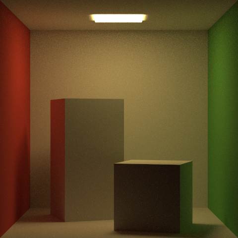

# muon

A subatomic path tracer.


## Feature set

* Integration:
  * Special purpose integrators (albedo, normals, depth)
  * Monte Carlo path tracer
  * BRDF Importance Sampling
  * Direct light sampling (Next Event Estimation)
  * Multiple Importance Sampling with NEE
* Materials:
  * Matte (Lambertian)
  * Physically based Phong
  * GGX
* Optimization:
  * Bounding Volume Hierarchy
  * Multithreaded rendering
* Golden image tests

## Developing

Muon uses [Bazel](https://bazel.build/) as its build system, which you can
[install via these instructions](https://docs.bazel.build/install.html). The
most recently tested version is bazel 3.7.1.

To build, run:

```
$ bazel build //muon
```

You can also use [bazel-watcher](https://github.com/bazelbuild/bazel-watcher)
to rebuild automatically after changes.

To execute a render, create a scene file (see the `samples/` directory for
examples) and run Muon:

```
$ ./bazel-bin/muon/muon --scene path/to/scene.muon
```

To build the compilation database, install
[bazel-compilation-database](https://github.com/grailbio/bazel-compilation-database)
and run:

```
$ bazel-compdb -s
```

To run the linter, first build the compilation database and then run:

```
$ clang-tidy muon/*.cc
```

To run the image diff tests, install ImageMagick and then run:

```
$ bazel test //test:all
```

## Gallery




## Attribution

Muon was built based on the wonderful course material by Ravi Ramamoorthi, both
Computer Graphics I on EdX and Computer Graphics II: Rendering, as well as the
amazing [PBR book](https://www.pbr-book.org/) and the [Ray Tracing in One
Weekend](https://raytracing.github.io/) series by Peter Shirley.

In addition, Muon would not be possible if not for the following open source
tools and libraries:
* GLM
* CImg
* abseil
* assimp
